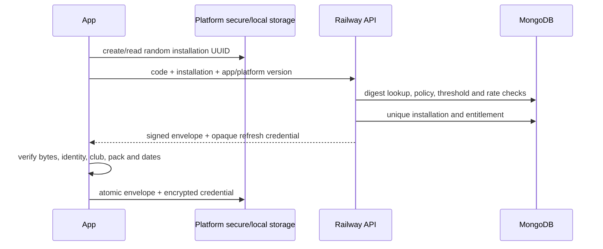
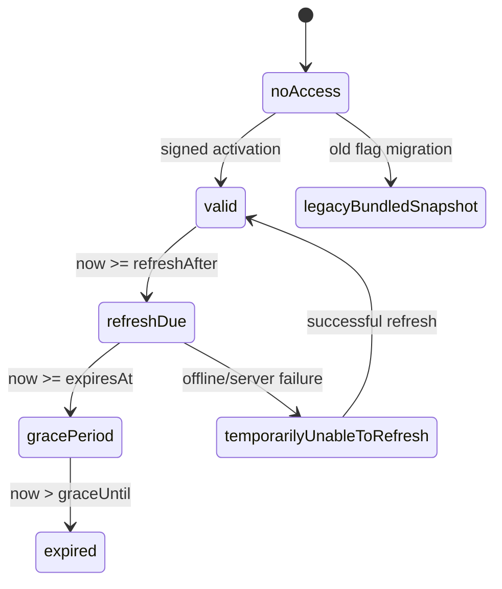

# Club licensing architecture

Operational procedures are in [`LICENSING_OPERATIONS_GUIDE.md`](LICENSING_OPERATIONS_GUIDE.md), and
member-facing activation instructions are in
[`CLUB_MEMBER_ACTIVATION_GUIDE.md`](CLUB_MEMBER_ACTIVATION_GUIDE.md).

## Scope and commercial boundary

This repository implements matching iPhone and Android licensing clients and a locally testable
Railway Node service. Implemented: invitation activation, MongoDB indexes and atomic reservations,
Ed25519 entitlements, credential-bound refresh, platform secure identity/credential storage, atomic
envelope storage, local verification, explicit access policy, retry backoff, legacy migration,
admin commands, and tests.

Clubs hold licences; members have no account and supply no personal details. `term` and `perpetual`
are distinct entitlement types. A perpetual entitlement has no expiry/grace timestamp. It can be
refresh-due and its update/service features can end independently, but an outage cannot invalidate
cached perpetual use.

The SYC agreement draft appears to grant perpetual use of the applicable SYC-specific App while
excluding ongoing maintenance, compatibility, course-data updates and services. Legal/commercial
review must confirm which released version/snapshot is covered, how breach termination applies, and
which future features are separate services. The agreement is not rewritten here. This is an
implementation constraint, not legal advice.

The released binary and bundled SYC data cannot be remotely revoked. This architecture controls
only new activation/releases, current packs, updates, and future services.

## Trust, privacy, and data retention

- Railway service variables hold the Ed25519 private key and separate invitation/refresh HMAC keys.
- The app embeds only public keys indexed by `keyId`.
- Invitation lookup is `base64url(HMAC-SHA-256(secret, "invitation:v1:" + uppercaseCode))`.
- Refresh credentials use a separate key and `refresh:v1:` domain. Plaintext is never stored.
- MongoDB stores clubs, digests, random installation IDs, minimal app/platform metadata, timestamps and
  entitlement state. Rate limiting stores a keyed IP digest, not a raw address.
- Logs emit only an error class—not codes, envelopes, credentials, keys, identity, or personal data.

No name, email, phone, contacts, Apple ID, advertising ID, precise location, or sailing history is
collected. Retain routine API logs no more than 30 days; MongoDB TTL indexes purge rate-limit rows. Delete or
irreversibly aggregate disabled operational records within 90 days after their support/legal need
ends. An installation can be disabled via the admin tool and later deleted with its entitlements.
Safe club reporting is aggregate activation/refresh volume and active/disabled installation counts.

## Activation and refresh

Routes are `POST /v1/activations`, `POST /v1/entitlements/refresh`, and `GET /v1/health`.
Errors have stable machine codes and generic public messages to limit invitation enumeration.
Repeated activation retains the unique installation row, rotates its opaque credential, and issues
a new entitlement. Invitation rotation prevents new activation but does not affect an existing
installation's independent refresh credential. Admin mutations have no public endpoint.

Launch reads and verifies cached state locally, renders immediately, then starts a due refresh in a
platform coroutine/task. The server is never on the launch critical path. A failure schedules exponential
retry from 15 minutes to 24 hours and preserves authenticated access. Explicit retry is available;
foreground events do not create an unconditional request loop.

## Exact entitlement format and verification

The JSON envelope is `{"payload":"BASE64URL","signature":"BASE64URL"}`. `payload` decodes to
the exact UTF-8 JSON bytes signed by Ed25519. Base64url uses the RFC 4648 URL alphabet without
padding. The app verifies decoded bytes and never re-encodes JSON for signature checking.

The server creates fields in this order: `schemaVersion`, `entitlementId`, `clubId`, sorted
`permittedPackIds`, `installationId`, `entitlementType`, sorted `enabledFeatures`, `issuedAt`,
`refreshAfter`, `expiresAt`, `graceUntil`, `perpetualAccess`, `keyId`. Timestamps are UTC RFC 3339
whole seconds. Schema v1 contains every field; nullable expiry/grace values are explicit JSON null.

The app rejects malformed base64/JSON, unknown schema or key, invalid signatures, installation,
club or pack mismatch, future/inconsistent dates, and invalid perpetual combinations. A newly
received envelope beyond grace is rejected. An already cached, authentic beyond-grace envelope is
retained only to provide safety-labelled access to downloaded reference data.

For key rotation, first ship an app containing old and new public keys, then change the Railway service key
and `keyId`; retain old public keys until all supported old envelopes are outside policy. On key
compromise, stop signing, rotate, ship/update the trusted set and reissue entitlements. Handling of
cached perpetual access must remain consistent with the SYC commercial grant.

## Access policy and legacy migration

Server timestamps are authoritative. Defaults: current before day 14, refresh-due from day 14,
grace from day 30 through day 60 inclusive, expired after day 60. Railway variables configure these
durations. Perpetual access has no commercial expiry and only becomes refresh-due.

Valid, refresh-due, grace and temporary-failure states retain normal reference access. Expired
access retains previously downloaded/bundled information with a stale warning but disables updates
and services. The last-known-good pack is never deleted for expiry or refresh failure. Policy is
centralized in `AccessState`, rather than decided by course screens.

Migration atomically writes a versioned legacy record limited to the bundled SYC pack, then records
migration version 1 and removes `trialAccessUnlocked`. A failed write leaves the old preference.
Repeated runs load the existing record. Legacy access is not signed and grants no other pack or
update eligibility. Fresh installations have no universal-code acceptance path.

## Provisioning, rollback, and recovery

Local setup is in `licensing-server/README.md`. Production still requires a Railway API and MongoDB
service, a generated Railway public URL, production HMAC/signing variables, monitoring/backups, and
Release-build endpoint/public-key injection. The website remains on Vercel. Object storage is not
provisioned. Do not use test keys.

Create and validate MongoDB indexes before launch and configure Railway volume backups. Roll back by
selecting the prior Railway API deployment while leaving data intact; never roll back by deleting entitlements.
Keep previous public keys during rollback. Alert on elevated rate limiting, aggregate activation
errors, and signing failures without sensitive request logging.

## Future signed runtime course packs

Runtime installation is intentionally deferred: `CourseDataLoader` and its callers are static and
bundle-oriented. MongoDB is deliberately chosen so future `coursePacks`, `notices`, `events`,
`courseAmendments`, and immutable `publishedReleases` can retain nested sailing content and approval
metadata without forcing it into licensing records. NTC documents, charts, maps, and downloadable
archives belong in Railway object storage; MongoDB should hold their metadata, hashes, applicability,
approval trail, and object keys rather than large binaries.

First introduce a `CoursePackRepository`, then publish a separately signed manifest containing pack
ID, monotonically increasing integer version, minimum app version, and SHA-256 for every file.
Resolve base packs plus approved club/series/race-specific NTC amendments into one immutable release;
the iPhone app must not merge arbitrary amendments itself. Authorize against `permittedPackIds`,
download to a temporary version directory, validate signatures, hashes, schemas, identities,
references and resources, atomically switch an active pointer, and preserve both last-known-good and
bundled fallbacks. Interrupted download, conflict, supersession, downgrade, corrupt resource and
rollback tests are prerequisites.
