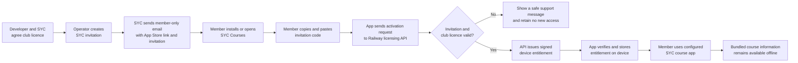
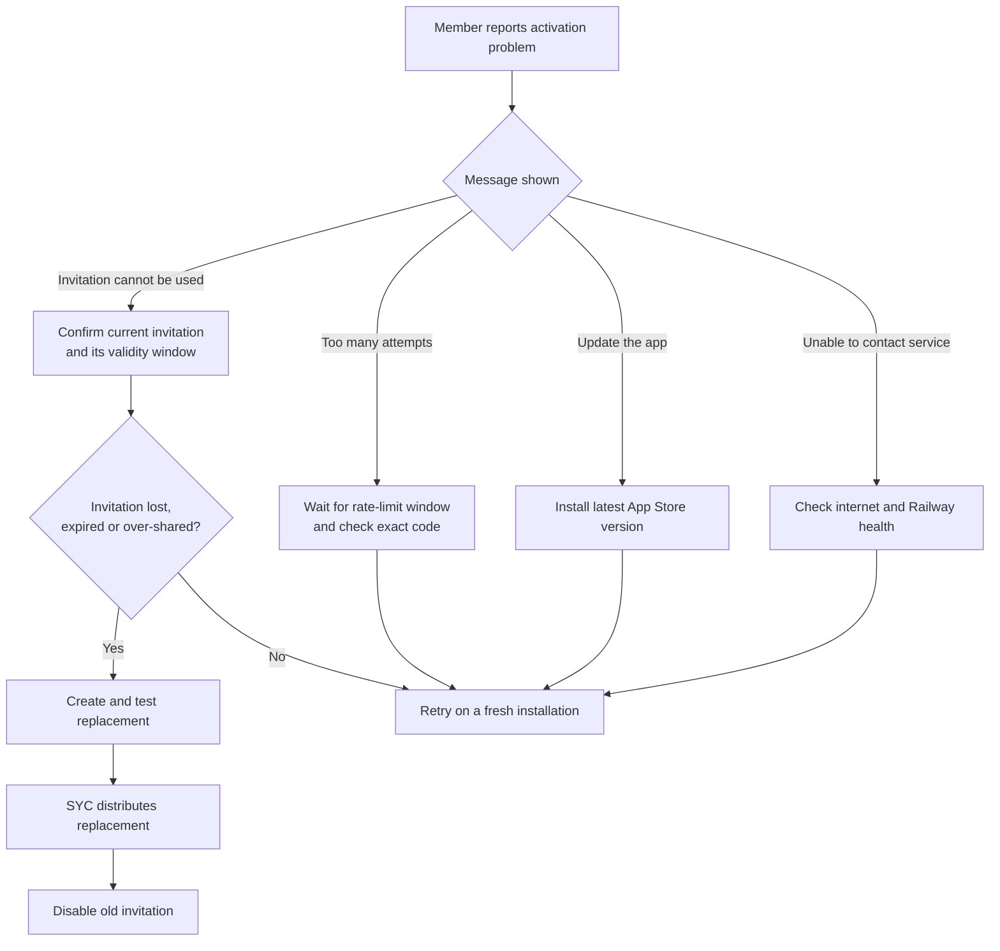

# SYC member distribution flow

This guide describes the launch-ready way to provide SYC Courses to Sandringham Yacht Club members
with minimal friction. The commercial licence is an arrangement between SYC and the developer.
Eligible members receive the app benefit from SYC at no charge; they do not buy a licence, create an
account, or provide personal details to the licensing service.

## Launch approach

SYC distributes two things through an approved member-only channel:

1. the public SYC Courses App Store link; and
2. the current SYC invitation code.

A member installs the app, copies the invitation from the SYC email, pastes it into **Club access**,
and taps **Activate club**. An internet connection is needed for initial activation. The app then
stores a signed entitlement and can open its bundled course information offline.

The invitation is only an activation credential. It is not a member account, proof of identity, or
individual purchase. The server records a random installation identifier and aggregate licence
state, not the member's name, email address, Apple ID, location, or sailing activity.

## Suggested SYC email

> **SYC Courses for members**
>
> SYC Courses is available to eligible Sandringham Yacht Club members at no charge.
>
> 1. Download or update **SYC Courses** from the App Store: **[APP STORE LINK]**
> 2. Open the app and copy this invitation into the **Club access** screen:
>
> **`CLUB-PASTE-CURRENT-INVITATION-HERE`**
>
> 3. Tap **Activate club**.
>
> An internet connection is required for the first activation. No account, payment or email address
> is required. Please do not forward the invitation outside the eligible SYC membership.

Replace both placeholders immediately before distribution. Send a test copy to an iPhone and
complete a fresh activation before sending the member communication.

## Responsibilities

| Party | Responsibility |
| --- | --- |
| Developer/operator | Keep the Railway service available, maintain signing secrets, issue and replace invitations, and provide aggregate operational support |
| SYC | Approve who is eligible, distribute the current invitation through member-only channels, and tell members when an invitation is replaced |
| Member | Install the current app, enter the invitation accurately, and avoid forwarding it outside the eligible membership |

The operator should retain the invitation ID separately from the plaintext invitation. The
plaintext is displayed once and cannot be retrieved from MongoDB. If it is lost or widely shared,
create a replacement, test it, distribute it, and then disable the previous invitation by ID.

## QR code option for launch

A QR code may contain the invitation as plain text. Scanning it lets a member view and copy the
invitation, but version 1.0.1 will not automatically open and activate the app. Always print the
invitation text and App Store link near the QR code so there is a clear fallback.

Do not place the invitation or QR code on a public website, social-media post, public noticeboard,
or public App Store material. A member email, authenticated member portal, or controlled clubhouse
communication is appropriate.

## Support flow

Support must not ask for a member's Apple ID, password, location, contacts, sailing history, or
other identity information. Aggregate installation counts are sufficient for licence operations.

## Optional later enhancement

A future release could add an HTTPS Universal Link and QR code that opens the installed app with the
invitation already filled in. That would require an Apple Associated Domains entitlement, a Railway
association endpoint and landing page, and link handling in the app. It is optional polish, not a
launch dependency. Implement it only if real member support experience shows that copy and paste is
causing meaningful friction.
